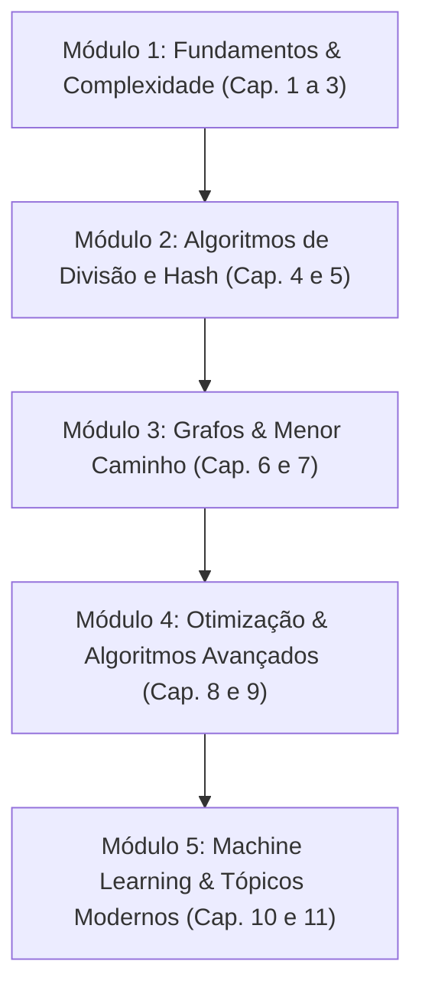

# Plano de Estudos: Entendendo Algoritmos (Grokking Algorithms)

> **Livro Base:** _Entendendo Algoritmos - Um Guia Ilustrado Para Programadores e Outros Curiosos_ (Aditya Y. Bhargava)

---

## Metodologia de Aprendizado (Papel do Professor)

Em cada etapa da nossa jornada, atuarei como seu professor e mentor técnico, seguindo o ciclo pedagógico:

1. **Intuição e Fundamentos:** Explicação conceitual sem jargões complexos desnecessários, com analogias visuais e cenários do dia a dia (seguindo o estilo didático do próprio livro).
2. **Análise de Complexidade:** Discussão do desempenho em tempo e espaço (Notação Big $O$).
3. **Implementação Guiada:** Implementação prática e limpa do algoritmo / estrutura de dados em código.
4. **Desafios e Exercícios Práticos:** Exercícios de fixação e problemas do tipo _LeetCode / HackerRank_ para consolidar a habilidade.
5. **Revisão e Próximos Passos:** Validação do que foi assimilado antes de avançar para a próxima etapa.

---

## Mapa da Jornada em 5 Módulos

---

## Módulo 1: Fundamentos, Complexidade e Estruturas Básicas

### Etapa 1: Introdução a Algoritmos e Complexidade (Capítulo 1)

- **Tópicos:**
  - O que são algoritmos e por que eficiência importa.
  - Pesquisa Simples vs. Pesquisa Binária (_Binary Search_).
  - Introdução à Notação Big $O$ ($O(1)$, $O(\log n)$, $O(n)$, $O(n \log n)$, $O(n^2)$, $O(n!)$).
  - Pior caso vs. caso médio.
  - O problema do Caixeiro-Viajante em tempo fatorial $O(n!)$.
- **Prática:**
  - Implementar o algoritmo de Busca Binária iterativo.
  - Simular e comparar o número de operações entre busca linear e binária.

### Etapa 2: Gerenciamento de Memória e Ordenação por Seleção (Capítulo 2)

- **Tópicos:**
  - Como a memória do computador funciona (gavetas de memória).
  - _Arrays_ (vetores) vs. _Linked Lists_ (listas encadeadas).
  - Vantagens e desvantagens: leitura aleatória vs. inserção/deleção.
  - Algoritmo de Ordenação por Seleção (_Selection Sort_).
  - Análise de tempo $O(n^2)$.
- **Prática:**
  - Implementar uma Lista Encadeada simples.
  - Implementar o _Selection Sort_ encontrando o menor elemento iterativamente.

### Etapa 3: Recursão e a Pilha de Chamadas (Capítulo 3)

- **Tópicos:**
  - O que é recursão e como evitar loops infinitos.
  - Caso-base (_base case_) e Caso recursivo (_recursive case_).
  - A Pilha (_Stack_) e a Pilha de Chamada (_Call Stack_).
  - Como a memória se comporta na recursão (custo de pilha e _Stack Overflow_).
- **Prática:**
  - Implementar funções recursivas clássicas (contagem regressiva, fatorial).
  - Rastrear a execução da pilha de chamadas passo a passo.

---

## Módulo 2: Dividir para Conquistar e Tabelas Hash

### Etapa 4: Dividir para Conquistar e Quicksort (Capítulo 4)

- **Tópicos:**
  - A estratégia _Dividir para Conquistar_ (D&C - _Divide and Conquer_).
  - Como quebrar problemas em subproblemas menores.
  - O algoritmo _Quicksort_ (escolha do pivô, particionamento).
  - Desempenho do Quicksort: Pior caso $O(n^2)$ vs. Caso Médio / Melhor caso $O(n \log n)$.
  - Comparativo: _Quicksort_ vs. _Mergesort_.
- **Prática:**
  - Resolver problemas de soma recursiva e contagem de elementos usando D&C.
  - Implementar o _Quicksort_ completo.

### Etapa 5: Tabelas Hash (Capítulo 5)

- **Tópicos:**
  - O que são Funções Hash (_Hash Functions_) e Tabelas Hash (_Hash Tables_ / Dicionários / Mapas).
  - Casos de uso reais: busca rápida $O(1)$, filtragem de duplicados, cache/memoização.
  - Colisões e como resolvê-las (listas encadeadas nos buckets).
  - Fator de carga (_Load Factor_) e redimensionamento (_Resizing_).
- **Prática:**
  - Criar um sistema de cache simples com verificação instantânea.
  - Implementar uma mini tabela hash com resolução básica de colisões.

---

## Módulo 3: Grafos e Algoritmos de Menor Caminho

### Etapa 6: Pesquisa em Largura - BFS (Capítulo 6)

- **Tópicos:**
  - O que são Grafos (Vértices e Arestas, Grafos direcionados vs. não direcionados).
  - Estrutura de dados Fila (_Queue_) - Princípio FIFO (First In, First Out).
  - Pesquisa em Largura (_Breadth-First Search_ - BFS).
  - Como encontrar o caminho mais curto em grafos não ponderados (menor número de passos).
  - Análise de tempo $O(V + E)$ (Vértices + Arestas).
- **Prática:**
  - Representar grafos usando tabelas hash / listas de adjacência.
  - Implementar BFS para encontrar conexões mais curtas em uma rede.

### Etapa 7: Algoritmo de Dijkstra (Capítulo 7)

- **Tópicos:**
  - Grafos ponderados (_Weighted Graphs_) vs. não ponderados.
  - Algoritmo de Dijkstra: encontrando o caminho de menor custo total.
  - Ciclos e o problema de arestas com pesos negativos (por que Dijkstra falha e quando usar Bellman-Ford).
  - Estruturas de suporte (tabela de custos, pais e nós processados).
- **Prática:**
  - Implementar o algoritmo de Dijkstra passo a passo com rastreamento de custos.
  - Resolver o clássico problema de menor custo em rotas.

---

## Módulo 4: Otimização, Aproximação e Programação Dinâmica

### Etapa 8: Algoritmos Gulosos e Problemas NP-Completos (Capítulo 8)

- **Tópicos:**
  - A estratégia Gulosa (_Greedy Strategy_): escolhas ótimas locais.
  - O problema do cronograma de salas de aula e o problema da cobertura de conjuntos (_Set-Covering_).
  - Algoritmos de aproximação: quando a perfeição é inviável computacionalmente.
  - Problemas NP-Completos (Caixeiro-viajante, Cobertura de Conjuntos, Problema da Mochila exata).
  - Como identificar se um problema é NP-completo.
- **Prática:**
  - Implementar o algoritmo guloso de aproximação para cobertura de estações de rádio.

### Etapa 9: Programação Dinâmica (Capítulo 9)

- **Tópicos:**
  - O que é Programação Dinâmica (DP) e como funciona a abordagem por tabelas (_grid_).
  - O Problema da Mochila 0/1 (_Knapsack Problem_).
  - Subproblemas ótimos e independência entre elementos.
  - Problema da Maior Substring Comum (_Longest Common Substring_) e Maior Subsequência Comum (_Longest Common Subsequence_).
- **Prática:**
  - Construir e preencher matrizes de DP para o problema da mochila.
  - Implementar algoritmo para encontrar a maior subsequência comum entre duas strings.

---

## Módulo 5: Machine Learning, Big Data e Além

### Etapa 10: K-Vizinhos Mais Próximos - KNN (Capítulo 10)

- **Tópicos:**
  - Algoritmo $K$-Nearest Neighbors ($K$-NN).
  - Classificação vs. Regressão.
  - Extração e normalização de características (_Feature Engineering_).
  - Cálculo de distâncias (Distância Euclidiana, Similaridade de Cossenos).
  - Aplicações práticas: Sistemas de recomendação (Netflix/Amazon), OCR, filtros de spam.
- **Prática:**
  - Implementar o cálculo de distância Euclidiana e um classificador / recomendador simples de $K$-NN.

### Etapa 11: Próximos Passos & Tecnologias do Mundo Real (Capítulo 11)

- **Tópicos:**
  - **Árvores:** Árvores Binárias de Busca (_BST_), B-Trees e Índices de Banco de Dados.
  - **Índices Invertidos:** Como funcionam motores de busca (Google, Elasticsearch).
  - **Transformada de Fourier:** Processamento de sinais, áudio e compressão de imagens.
  - **Algoritmos Paralelos e Distribuídos:** O paradigma MapReduce.
  - **Estruturas de Dados Probabilísticas:** Filtro de Bloom e HyperLogLog (como lidar com Big Data).
  - **Criptografia e Segurança:** Hashes criptográficos (SHA-256), Hashes Locais (SimHash), Troca de chaves Diffie-Hellman.
  - **Programação Linear:** Otimização com restrições (Simplex).
- **Prática:**
  - Explorar uma árvore binária de busca simples e testar um filtro de Bloom.
